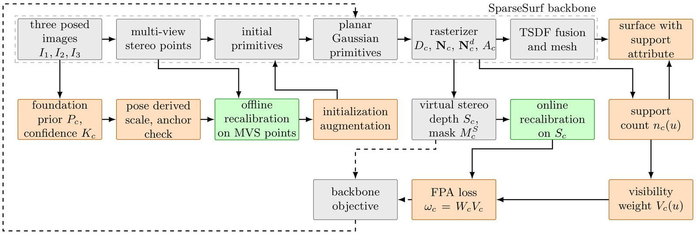

<div align="center">

# AFP-GS

---

### Anchored foundation prior Gaussian splatting for surface reconstruction of built assets from three images

<a href="https://twakjira.github.io/AFP-GS/" target="_blank" rel="noopener noreferrer"></a>
<a href="#" target="_blank" rel="noopener noreferrer"></a>
<a href="#data"></a>

<a href="https://www.ai4riselab.com" target="_blank" rel="noopener noreferrer">Tadesse G. Wakjira</a>

*Under Review*

</div>

---

## Overview

AFP-GS reconstructs the surface of a built asset from three photographs. Surface observed by
only one or two images receives no multiview constraint, and sparse view Gaussian splatting
methods leave holes there. AFP-GS adds two modules to the SparseSurf backbone. Foundation prior
anchoring aligns the point map of a visual geometry grounded transformer to the scene, adds
primitives where the multiview stereo initialization has no support, and supervises the rendered
geometry with a confidence and visibility weighted loss. Anchored recalibration removes the slowly
varying depth offset of the prior with a per view correction fitted to the multiview stereo
geometry.

<div align="center">

</div>

On the fifteen DTU scenes with three views, the mean Chamfer distance falls from 1.18 mm for the
reproduced reference method to 0.81 mm in the little overlap protocol, below the 0.85 mm of the
strongest published method, and reaches 0.85 mm in the large overlap protocol, below the published
0.89 mm. On four ETH3D built environments scored against terrestrial laser scans, with the same
configuration, the mean F1 score at 5 cm rises from 0.51 to 0.79, and AFP-GS is higher on every scene.
The count of views supporting each output vertex predicts the reconstruction error without ground
truth, with an area under the curve of 0.73 on DTU and 0.74 on the built environments.

An interactive viewer of the reconstructions and the full set of figures are available at the
<a href="https://twakjira.github.io/AFP-GS/" target="_blank" rel="noopener noreferrer">project page</a>.

## Status

The manuscript is under review, this repository holds the project page only, and the code, the
configuration files, and the trained models follow on acceptance.

## Architectural contributions

| | Element |
|---|---|
| M1 | Foundation prior anchoring: the transformer point map is scaled to the scene through the predicted camera centres, adds primitives where the multiview stereo cloud has no support, and supervises rendered depth and normals |
| M2 | Anchored recalibration: a per view affine correction with a quadratic spatial offset fitted to the multiview stereo points before optimization and to the stereo depth every 300 iterations, with model selection by anchor residual |
| C1 | Visibility weight: the prior loss is doubled on surface observed by a single training view |
| C2 | Confidence weight: pixels below the thirtieth confidence percentile receive no weight and pixels above the ninetieth receive full weight |
| C3 | Admissibility check: a fitted correction is kept only when the median anchor residual falls below one percent of the median depth and the fitted scale lies between 0.7 and 1.4 |
| C4 | Support attribute: the count of views agreeing on the surface is exported for every output vertex and predicts where the surface is wrong |

## Results

Mean Chamfer distance in mm over the fifteen DTU scenes with three views.

| Method | Little overlap | Large overlap |
|---|---|---|
| SparseCraft | 1.83 | |
| C2F2NeUS | | 1.11 |
| Sparse2DGS | | 1.13 |
| UFORecon | 1.40 | 0.99 |
| FatesGS | 1.37 | 0.92 |
| NeuSurf | 1.35 | 0.99 |
| SparseSurf, reproduced | 1.18 | 0.87 |
| SparseRecon | 1.06 | |
| SparseSurf, published | 1.05 | 0.89 |
| DP-GS | 1.02 | |
| DP-GS with MASt3R initialization | 0.85 | |
| **AFP-GS, proposed** | **0.81** | **0.85** |

F1 score at 5 cm against terrestrial laser scans on four ETH3D built environments, three views.

| Scene | SparseSurf, reproduced | AFP-GS, proposed |
|---|---|---|
| kicker, indoor room | 0.272 | **0.883** |
| playground, outdoor play area | 0.216 | **0.361** |
| relief, stone relief | 0.701 | **0.954** |
| relief_2, stone relief | 0.837 | **0.948** |
| **Mean** | 0.506 | **0.786** |

## Data

| Source | Use |
|---|---|
| <a href="https://roboimagedata.compute.dtu.dk/?page_id=36" target="_blank" rel="noopener noreferrer">DTU multiview stereo dataset</a> | Images, camera calibration, object masks, and reference scans of the fifteen benchmark scenes |
| <a href="https://github.com/yulunwu0108/FatesGS" target="_blank" rel="noopener noreferrer">FatesGS three view split</a> | The little overlap and large overlap view selections and the processed scene files |
| <a href="https://github.com/miya-oi/SparseSurf" target="_blank" rel="noopener noreferrer">SparseSurf</a> | Backbone code and released multiview stereo initialization |
| <a href="https://github.com/facebookresearch/vggt" target="_blank" rel="noopener noreferrer">VGGT</a> | Visual geometry grounded transformer used as the foundation prior |
| <a href="https://www.eth3d.net/datasets" target="_blank" rel="noopener noreferrer">ETH3D high resolution multiview benchmark</a> | Four built environment scenes with terrestrial laser scans for the metric evaluation |

## Citation

```
@article{wakjira2026afpgs,
    title   = {Anchored foundation prior Gaussian splatting for surface
               reconstruction of built assets from three images},
    author  = {Wakjira, Tadesse G.},
    journal = {Under Review},
    year    = {2026}
}
```

## Authors

<strong><a href="https://www.ai4riselab.com" target="_blank" rel="noopener noreferrer">Tadesse G. Wakjira</a></strong> (<a href="https://github.com/twakjira" target="_blank" rel="noopener noreferrer">@twakjira</a>), AI4RISE Lab, Department of Civil and Environmental Engineering, Kennesaw State University

## Development

Developed by the <a href="https://www.ai4riselab.com" target="_blank" rel="noopener noreferrer">AI4RISE Lab</a>
